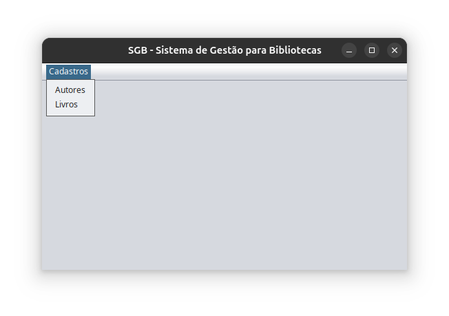
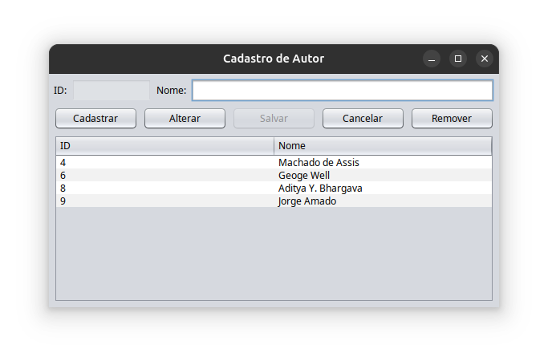
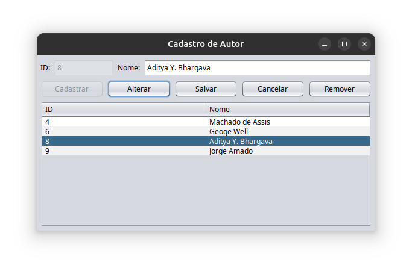
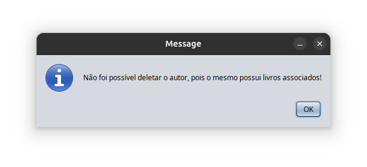
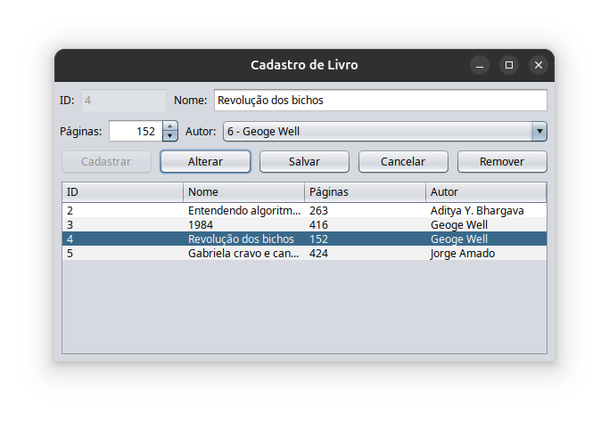

# 📚 Library-Java

[🇬🇧] A simple Library Management System developed in Java 24, applying the MVC architecture and using the DAO pattern for database interactions. The system uses MySQL 8.0.42 for data persistence and provides a graphical user interface (GUI) in Portuguese.

[🇧🇷] Um Sistema de Gerenciamento de Bibliotecas desenvolvido em Java 24, aplicando a arquitetura MVC e utilizando o padrão DAO para interações com o banco de dados. O sistema utiliza MySQL 8.0.42 para persistência de dados e possui uma interface gráfica (GUI) em português.

---

## ✅ Features | Funcionalidades

- [🇬🇧] Register and manage books and authors
- [🇧🇷] Cadastro e gerenciamento de livros e autores

- [🇬🇧] MVC architecture for better organization and scalability
- [🇧🇷] Arquitetura MVC para melhor organização e escalabilidade

- [🇬🇧] DAO pattern for clean and efficient database access
- [🇧🇷] Padrão DAO para acesso ao banco de dados de forma limpa e eficiente

- [🇬🇧] GUI in Portuguese using Java Swing
- [🇧🇷] Interface gráfica em português utilizando Java Swing

---

## 🛠️ Technologies | Tecnologias

- Java 24
- MySQL 8.0.42
- Java Swing (GUI)
- JDBC (Database connection)

---

## 🗄️ Database Setup | Configuração do Banco de Dados

### 1. Locate the SQL dump | Localize o arquivo SQL

[🇬🇧] The SQL dump is located at:  
[🇧🇷] O arquivo de dump SQL está localizado em:

```
/src/main/resources/dump-library-202505252112.sql
```

### 2. Restore the database | Restaure o banco de dados

[🇬🇧] Use the following command to restore the database:  
[🇧🇷] Use o seguinte comando para restaurar o banco de dados:

```bash
mysql -u your_user -p your_database < dump-library-202505252112.sql
```

[🇬🇧] Replace `your_user` with your MySQL user and `your_database` with the name of the database you want to restore.  
[🇧🇷] Substitua `your_user` pelo seu usuário do MySQL e `your_database` pelo nome do banco de dados.

### 3. Configure db.properties | Configure o db.properties

[🇬🇧] The file is located at:  
[🇧🇷] O arquivo está localizado em:

```
/src/main/resources/db.properties
```

[🇬🇧] Edit it with your actual database credentials:  
[🇧🇷] Edite com as credenciais reais do seu banco de dados:

```properties
db.url=jdbc:mysql://localhost:3306/library
db.user=your_user
db.password=your_password
```

[🇬🇧] Make sure:  
[🇧🇷] Certifique-se:

- ✅ The database exists and was restored | O banco de dados existe e foi restaurado
- ✅ The user and password match your MySQL configuration | O usuário e senha correspondem ao seu MySQL
- ✅ The port 3306 is correct (or adjust if necessary) | A porta 3306 está correta (ou ajuste se necessário)

---

## 🚀 How to Run | Como Executar

### Prerequisites | Pré-requisitos

- Java 24 installed | Java 24 instalado
- MySQL 8.0.42 configured | MySQL 8.0.42 configurado
- Database restored and db.properties properly set | Banco de dados restaurado e db.properties configurado

### Steps | Passos

1. **Clone the repository | Clone o repositório:**
   ```bash
   git clone https://github.com/Rafael-de-Sa/Library-Java.git
   ```

2. **Open the project in your IDE | Abra o projeto na sua IDE**

3. **Check database configuration | Verifique a configuração do banco de dados:**
   - [🇬🇧] Ensure that `/src/main/resources/db.properties` has your correct MySQL credentials
   - [🇧🇷] Garanta que o arquivo `/src/main/resources/db.properties` contém as credenciais corretas

4. **Run the application | Execute a aplicação:**
   - [🇬🇧] Compile and run the project via your IDE
   - [🇧🇷] Compile e execute o projeto através da sua IDE

---

## 📸 Screenshots







---

## 🙋‍♂️ Author | Autor

**Rafael de Sá**  
[GitHub](https://github.com/Rafael-de-Sa) | [LinkedIn](https://www.linkedin.com/in/rafael-de-sa/)